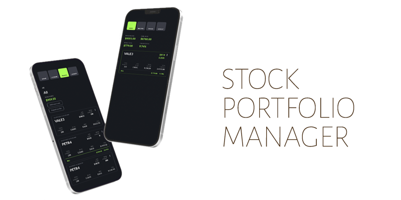
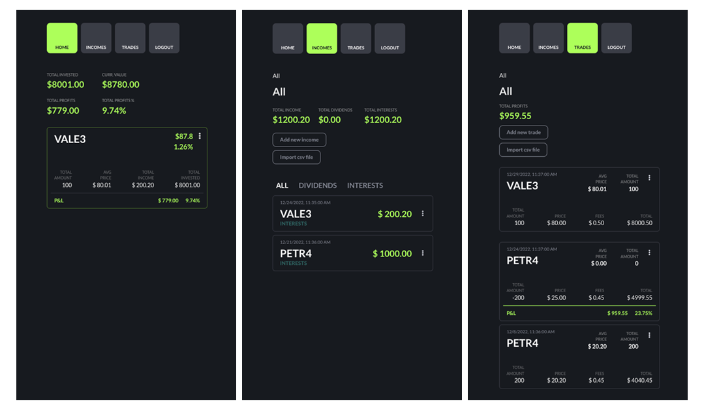

A simple app to keep track of all your stock portfolio as well as all the incomes from interests and dividends. You can filter by year, stocks, and keep track of all your profits and current values.
Add trades and incomes manually or import a csv file.



## Backend:

-  Language: Typescript
-  Databases: MongoDB & Redis (Cache for External API Stock Prices)
-  NodeJs / Express / Mongoose
-  Auth: Social login using Google
-  Tests: Jest

## Frontend:

-  Language: Javascript
-  React + Chackra UI

## Live app:

<i>Not currently deployed</i>

---

## Local Development:

(To run this application you must setup OATH in google console)

#### 1. Download repository and install dependencies in frontend and backend folder

#### 2. Setup .env file at the root (check dev passwords in docker-compose file):

```
MONGO_URL="mongodb://"
REDIS_URL="redis://"
GCP_OAUTH_ID=
GCP_OAUTH_SECRET=
GCP_OAUTH_CALLBACK="http://localhost/oauth/google/callback"
COOKIE_KEY=
FRONTEND="http://localhost:5000"
```

#### 3. Go to ./backend and start docker compose

```
docker-compose up -d
```

#### 4. Start Application (at the the root) and go to http://localhost.com:5000/

```
npm run build
npm run start
```

#### 5. For watch folder in development mode (at the root):

frontend: port 3000 / backend: port 5000

```
npm run dev
```
